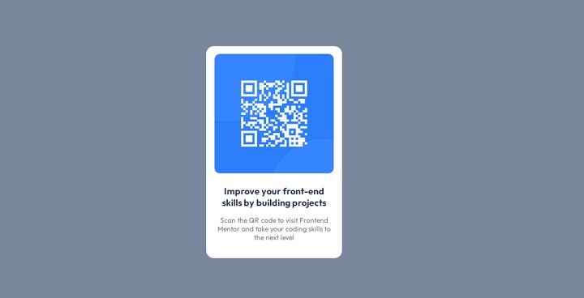

# Frontend Mentor - QR code component solucion

Esta es una solucion para [QR code component challenge on Frontend Mentor](https://www.frontendmentor.io/challenges/qr-code-component-iux_sIO_H). 

## Tabla de contenido

- [Captura pantalla](#captura-pantalla)
- [Mi proceso](#mi-proceso)
 - [Construido con](#construido-con)  
- [Autor](#autor)

### Captura pantalla

## Mi proceso

### Construido con

- HTML5 marcado semantico
- CSS para estilos
- Flexbox para disposicion de cajas

## Autor

- Frontend Mentor - [@rimar-basaa](https://www.frontendmentor.io/profile/rimar-basaa)

